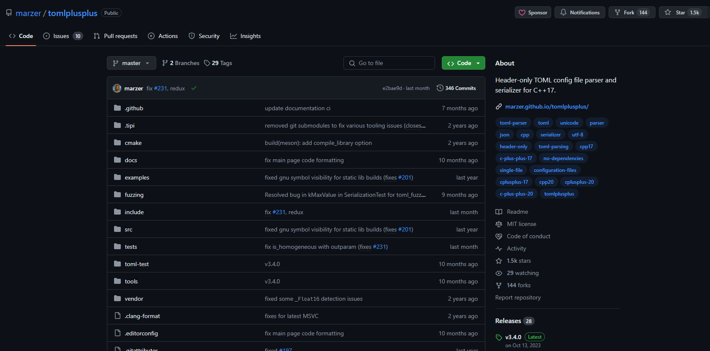

## 链接
- [toml++ - github](https://github.com/marzer/tomlplusplus)


- [toml++ - 帮助文档 ](https://marzer.github.io/tomlplusplus/)


- 使用要求： c++ 17 及以上版本
- [toml语法-英文](https://toml.io/en/)
- [toml语法-中文](https://toml.io/cn/)

## 读取toml文件(read toml file)
- 可查看[example_read](./example_read)中的示例代码， 更多关于读取的用法，请参见[官方](https://marzer.github.io/tomlplusplus/)用法
- You can read the demo code from [example_read](./example_read)

## 写入toml文件(write toml file)
- 可查看[example_write](./example_write)中的示例代码
- You can read the demo code from [example_write](./example_write)


## 概述 (outline)
- 已通过测试: MSVC++16(Visual Studio 2019)
- tested on MSVC++16(Visual Studio 2019)
- 文件组织
- file organization

```
.
├─cmake			# 存放公用的cmake的一些函数和宏的封装
├─CommonSource		# 存放不同项目之间可能公用的代码
├─example_read		# 读取toml文件代码
│  ├─exam_file		# 存放 example.toml文件
│  └─src		# 存放读取toml文件范例代码
└─example_write		# 写入toml文件的代码
    └─src		# 存放写入toml文件的代码
```

## 编译 comiler
- 请安装`cmake` 3.23及以上版本
- please install `cmake` that version is greather `3.22`
- 编译演示 (demo to compiler) 


## 读取 toml文件代码
- 详见[read.cpp](./example_read/src/read.cpp)
- see [read.cpp](./example_read/src/read.cpp)
```
#include <string>
#include <iostream>
#include <toml>

#ifdef _WIN32
#include <windows.h>
#else
#include <sys/statfs.h>
#include <limits.h>
#include <stdio.h>
#include <string.h>
#include <unistd.h>
#endif /// 


/// @brief executable path
/// @return to get the app's executable path 
static std::string appPath()
{
#ifdef _WIN32
	char path[1024 * 6] = { 0 };
	::GetModuleFileName(NULL, path, 255);
	(strrchr(path, '\\'))[1] = 0;

	return std::string(path);
#else
	char* p = NULL;

	const int len = 1024 * 8;
	/// to keep the absolute path of executable's path
	char arr_tmp[len] = { 0 };

	int n = readlink("/proc/self/exe", arr_tmp, len);
	if (NULL != (p = strrchr(arr_tmp, '/')))
		*p = '\0';
	else
	{
		return std::string("");
	}

	return std::string(arr_tmp);
#endif /// 
}


/// @brief to ouput the whole file's content
/// @param examFile 
void outputFile(const std::string& examFile)
{
	using namespace toml;
	/// 2. to parse the toml file
	parse_result config = parse_file(examFile);

	/// 3. to output the file's content
	std::cout << config << "\n";
}


int main(int argc, char** argv, char** envp)
{
	/// 1. to get the toml example file
    std::string tomlFile{appPath() + std::string{"/example.toml"}};

	/// 2. to output the whole file's content 
	// outputFile(tomlFile);

    using namespace toml;
	/// 2. to parse the toml file
	parse_result config = parse_file(tomlFile);

    /// 3. to read string: title
    {
        /// title= TOML Example
		const std::string str = config["title"].value<std::string>().value();
        std::cout << "title= " << str << std::endl << "\n";
    }
    
    /// read integer
    {
        /// int1= -9223372036854775808
        /// int2= 9223372036854775807

        int64_t int1 = config["int1"].value<int64_t>().value();
        int64_t int2 = config["int2"].value<int64_t>().value();
        std::cout << "int1= " << int1 << std::endl;
        std::cout << "int2= " << int2 << std::endl << "\n";
    }
	/// read float point 
	{
		/// # floats
        /// flt1 = 0.00000000001
        /// flt2 = 1e-11
        /// flt3 = 11.0
        /// flt4 = +1.0
		double flt1 = config["flt1"].value<double>().value();
		double flt2 = config["flt2"].value<double>().value();
		double flt3 = config["flt3"].value<double>().value();
		double flt4 = config["flt4"].value<double>().value();
		std::cout << "flt1=" << flt1 << std::endl;
        std::cout << "flt2=" << flt2 << std::endl;
        std::cout << "flt3=" << flt3 << std::endl;
        std::cout << "flt4=" << flt4 << std::endl << "\n";
	}
    /// read the date and time
    {
		/// tim1 = 07:32:00
		toml::time tim1 = config["tim1"].value<toml::time>().value();
		std::cout << "tim1=" << tim1 << ", hour=" << (int)tim1.hour << ", minute=" << (int)tim1.minute << ", second=" << (int)tim1.second << "\n";

		/// tim2 = 00:32:00.100000000
		toml::time tim2 = config["tim2"].value<toml::time>().value();
		std::cout	<< "tim1=" << tim1 << ", hour=" << (int)tim1.hour << ", minute=" << (int)tim1.minute << ", second=" 
					<< (int64_t)tim1.second << ", nanosecond=" << (int64_t)tim2.nanosecond << "\n";
		/// dat1 = 1979-05-27
		toml::date dat1 = config["dat1"].value<toml::date>().value();
		std::cout << "dat1=" << dat1 << ", year=" << (int)dat1.year << ", month=" << (int)dat1.month << ", day=" << (int)dat1.day << "\n" << "\n";
	}

	/// read date time
	{
		/// odt1 = 1979-05-27T07:32:00Z
		toml::date_time odt1 = config["odt1"].value<toml::date_time>().value();
		std::cout << "odt1=" << odt1 << ", year=" << (int)odt1.date.year << ", month=" << (int)odt1.date.month << ", day=" << (int)odt1.date.day
			<< " hour=" << (int)odt1.time.hour << ", minute=" << (int)odt1.time.minute << ", second=" << (int)odt1.time.second << ", offset=" << (int)odt1.offset->minutes << "\n\n";

	}
	/// read string of multiple lines  
	{
		///# strings
		///	str1 = """
		///	This is a
		///	multi - line
		///	string.
		///	"""
		std::string str1 = config["str1"].value<std::string>().value();
		std::cout << "str1=" << str1 << "\n\n";
	}

	/// read array
	{
		/// arr = ['this', 'is', 'a', 'long', 'array', 'with', 16, 'elements.', 'it', 'should', 'be', 'printed', 'as', 'a', 'multiline', 'array.']
		toml::array* parr = config["arr"].as_array();

		size_t arrSize = parr->size();
		std::cout << "arr count=" << arrSize << "\n";
		for (size_t index = 0; index < arrSize; ++index)
		{
			toml::node* pNode = parr->get(index);
			toml::node_view<toml::node> tmpIndexNode{ *pNode };
			if (true == tmpIndexNode.is_integer())
			{
				std::cout << " " << tmpIndexNode.value<int64_t>().value();
			}
			
			if (true == tmpIndexNode.is_string())
			{
				std::cout << " " << tmpIndexNode.value<std::string>().value();
			}
		}

		std::cout << "\n\n";
	}
	/// read table
	{
		/// tab = { this = 'is', an = 'inline', table = 'yay'}
		toml::node_view<toml::node> tabNode = config["tab"];
		/// key=this,	value=is
		/// key=an,		value = inline
		/// key=table,	value='yay'
		std::cout << "this " << tabNode.at_path("this").value<std::string>().value();
		std::cout << " an " << tabNode.at_path("an").value<std::string>().value();
		std::cout << " table " << tabNode.at_path("table").value<std::string>().value() << "\n\n";
	}
	
	/// read:  dotted.keys
	{
		/// dotted.keys.are = "supported"
		std::cout << "dotted.keys.are " << config.at_path("dotted.keys.are").value<std::string>().value() << "\n";
		std::cout << "dotted.keys.are " << config["dotted"]["keys"]["are"].value<std::string>().value() << "\n\n";
	}

	/// read owner table
	{
		/// [owner]
		/// name = "Mark Gillard"
		/// dob = 1987 - 03 - 16 10:20 : 00 + 09 : 30
		std::cout << "name=" << config["owner"]["name"].value<std::string>().value() << "\n";
		std::cout << "dob=" << config["owner"]["dob"].value<toml::date_time>().value() << "\n";
		
		/// another way to read
		toml::node_view<toml::node> ownerNode = config["owner"];
		std::cout << "name=" << oct::toStdString(ownerNode, "name") << "\n";
		std::cout << "dob=" << ownerNode["dob"].value<toml::date_time>().value() << "\n\n";
	}

	/// read the sub table of owner
	{
		///	[owner]
		///	name = "Mark Gillard"
		///	dob = 1987 - 03 - 16 10:20 : 00 + 09 : 30
		///
		///	[[owner.pets]]
		///	name = "Brian"
		///	species = "cat"
		///
		///	[[owner.pets]]
		///	name = "Skippy"
		///	species = "kangaroo"
		toml::node_view<toml::node> ownerPetsNode = config["owner"]["pets"];
		toml::array* petsArr = ownerPetsNode.as_array();
		std::cout << "pets arr's count =" << petsArr->size() << "\n";
		for (size_t index = 0; index < petsArr->size(); ++index)
		{
			toml::node* pNode = petsArr->get(index);
			toml::node_view<toml::node> tmpIndexNode{ *pNode };
			std::cout << "index=" << index << ", name=" << oct::toStdString(tmpIndexNode, "name") << ", species=" << oct::toStdString(tmpIndexNode, "species") << "\n";
		}
	}
    
	std::cout << "\n\n";

	return 0;
}
```

## 写toml文件（write toml file)
- 详见[write.cpp](./example_write/src/write.cpp)
- see [write.cpp](./example_write/src/write.cpp)

```c++
#include <string>
#include <iostream>
#include <toml>
#include <unordered_map>

#ifdef _WIN32
#include <windows.h>
#else
#include <sys/statfs.h>
#include <limits.h>
#include <stdio.h>
#include <string.h>
#include <unistd.h>
#endif /// 


/// @brief executable path
/// @return to get the app's executable path 
static std::string appPath()
{
#ifdef _WIN32
	char path[1024 * 6] = { 0 };
	::GetModuleFileName(NULL, path, 255);
	(strrchr(path, '\\'))[1] = 0;

	return std::string(path);
#else
	char* p = NULL;

	const int len = 1024 * 8;
	/// to keep the absolute path of executable's path
	char arr_tmp[len] = { 0 };

	int n = readlink("/proc/self/exe", arr_tmp, len);
	if (NULL != (p = strrchr(arr_tmp, '/')))
		*p = '\0';
	else
	{
		return std::string("");
	}

	return std::string(arr_tmp);
#endif /// 
}


int main(int argc, char** argv, char** envp)
{
	/// 1. write key-value pairs
	///  key="name", value="oct"
	///  key="is famel", value=false
	{
		toml::table tbl{};
		oct::tableNodeInsert<std::string>(tbl, "name", {"oct"});
		oct::tableNodeInsert<int64_t>(tbl, "age", 16);
		oct::tableNodeInsert<bool>(tbl, "is_famel", false);
		oct::tableNodeInsert<double>(tbl, "score", 99.99);
	
		/// 设置将要生成的文件
		std::string tomlFile = appPath() + "/1.toml";
		std::ofstream file(tomlFile, std::ios::out | std::ios::trunc);
		if (false == file.is_open())
		{
			std::cout << "\n failed to open the file=" << tomlFile << "\n\n";
		}
		else 
		{
			/// 写入文件
			file << tbl;
			file.close();
		}
	}
	/// 2. write hex 、oct and bin
	{
		toml::table tbl{};

		/// 将 10进制的12按照 binary、oct and hex 写入
		int64_t writeValue {12};

		toml::value<int64_t> binaryValue(writeValue);		
		binaryValue.flags(toml::value_flags::format_as_binary);

		toml::value<int64_t> hexValue(writeValue);
		hexValue.flags(toml::value_flags::format_as_hexadecimal);

		toml::value<int64_t> octValue(writeValue);
		octValue.flags(toml::value_flags::format_as_octal);

		tbl.insert_or_assign("binary", binaryValue);
		tbl.insert_or_assign("hex", hexValue);
		tbl.insert_or_assign("oct", octValue);

		/// 设置将要生成的文件
		std::string tomlFile = appPath() + "/2.toml";
		std::ofstream file(tomlFile, std::ios::out | std::ios::trunc);
		if (false == file.is_open())
		{
			std::cout << "\n failed to open the file=" << tomlFile << "\n\n";
		}
		else 
		{
			/// 写入文件
			file << tbl;
			file.close();
		}
	}
	/// 3. 
	{
		/// target toml file content 
		/// 	[TOML_DEMO]
		/// 	bool = false
		/// 	integer = 1234567890
		/// 	string = 'this is a string'
		

		toml::table rootNode{};
		/// 参数1-哪个表，参数2-节点的key, 参数3-将要插入的值
		oct::tableNodeInsert<std::string>(rootNode, "string", "this is a string");
		oct::tableNodeInsert<bool>(rootNode, "bool", false);
		oct::tableNodeInsert<int64_t>(rootNode, "integer", 1234567890);

		toml::table tbl{};
		/// 创建[NET_INTERFACE]
		tbl.insert_or_assign("TOML_DEMO", rootNode);

		/// 设置将要生成的文件
		std::string tomlFile = appPath() + "/3.toml";
		std::ofstream file(tomlFile, std::ios::out | std::ios::trunc);
		if (false == file.is_open())
		{
			std::cout << "\n failed to open the file=" << tomlFile << "\n\n";
		}
		else 
		{
			/// 写入文件
			file << tbl;
			file.close();
		}
	}
	/// 4. 
	{
		/// target toml file content

		/// [TOML_DEMO]
		/// bool = false
		/// integer = 1234567890
		/// string = 'this is a string'

		/// [[fruit]]
		/// kilograms = 2
		/// name = 'banana'

		/// [[fruit]]
		/// kilograms = 1
		/// name = 'apple'

		/// [[fruit]]
		/// kilograms = 3
		/// name = 'blueberry'


		toml::table rootNode{};
		oct::tableNodeInsert<std::string>(rootNode, "string", "this is a string");
		oct::tableNodeInsert<bool>(rootNode, "bool", false);
		oct::tableNodeInsert<int64_t>(rootNode, "integer", 1234567890);

		toml::table tblNode{};
		/// 创建[NET_INTERFACE]
		tblNode.insert_or_assign("TOML_DEMO", rootNode);

		/// 下一是一个数组的写入
		
		{
			/// 定义了水果信息
			struct FruitInfo
			{
				/// 水果的名称
				std::string     m_name{""};
				/// 水果的重量
				int64_t         m_kilograms{0};
			};

			/// <key-水果的名称，value-水果信息>
			using HashFruitInfo = std::unordered_map<std::string, FruitInfo>;

			HashFruitInfo fruitInfoHash{{"apple", {"apple", 1}}, {"banana", {"banana", 2}}, {"blueberry", {"blueberry", 3}}};


			toml::array tmpArr;
			// for(auto& [key, value] : tmpArr)
			for (HashFruitInfo::iterator it = fruitInfoHash.begin(); it != fruitInfoHash.end(); ++ it)
			{
				toml::table tblTmp{};
				oct::tableNodeInsert<std::string>(tblTmp, "name", it->first);
				oct::tableNodeInsert<int64_t>(tblTmp, "kilograms", it->second.m_kilograms);

				tmpArr.insert(tmpArr.begin(), tblTmp);
			}

			/// 将数组中的内容
			tblNode.insert_or_assign("fruit", tmpArr);
		}


		std::string tomlFile = appPath() + "/4.toml";
		std::ofstream file(tomlFile, std::ios::out | std::ios::trunc);
		if (false == file.is_open())
		{
			std::cout << "\n failed to open the file=" << tomlFile << "\n\n";
		}
		else 
		{
			/// 写入文件
			file << tblNode;
			file.close();
		}
	}

	/// 5. 
	{
		/// TOML FILE CONTENTS
		/// [TOML_DEMO]
		/// bool = false
		/// bool_arr = [ false, false ]
		/// complex_arr = [ false, '456', 123 ]
		/// integer = 1234567890
		/// integer_arr = [ 1, 0 ]
		/// str_arr = [ '1', '0' ]
		/// string = 'this is a string'
		/// 
		///     [[NET_INTERFACE.fruit]]
		///     kilograms = 2
		///     name = 'banana'
		/// 
		///     [[NET_INTERFACE.fruit]]
		///     kilograms = 1
		///     name = 'apple'
		/// 
		///     [[NET_INTERFACE.fruit]]
		///     kilograms = 3
		///     name = 'blueberry'

		toml::table rootNode{};
		oct::tableNodeInsert<std::string>(rootNode, "string", "this is a string");
		oct::tableNodeInsert<bool>(rootNode, "bool", false);
		oct::tableNodeInsert<int64_t>(rootNode, "integer", 1234567890);

		toml::table tblNode{};
		/// 创建[NET_INTERFACE]
		tblNode.insert_or_assign("TOML_DEMO", rootNode);

		/// 下一是一个数组的写入
		{
			/// 定义了水果信息
			struct FruitInfo
			{
				/// 水果的名称
				std::string     m_name{""};
				/// 水果的重量
				int64_t         m_kilograms{0};
			};

			/// <key-水果的名称，value-水果信息>
			using HashFruitInfo = std::unordered_map<std::string, FruitInfo>;

			HashFruitInfo fruitInfoHash{{"apple", {"apple", 1}}, {"banana", {"banana", 2}}, {"blueberry", {"blueberry", 3}}};


			toml::array tmpArr;
			// for(auto& [key, value] : tmpArr)
			for (HashFruitInfo::iterator it = fruitInfoHash.begin(); it != fruitInfoHash.end(); ++ it)
			{
				toml::table tblTmp{};
				oct::tableNodeInsert<std::string>(tblTmp, "name", it->first);
				oct::tableNodeInsert<int64_t>(tblTmp, "kilograms", it->second.m_kilograms);

				tmpArr.insert(tmpArr.begin(), tblTmp);
			}

			/// 将数组中的内容 - 关键代码
			tblNode["TOML_DEMO"].as_table()->insert_or_assign("fruit", tmpArr);
		}


		std::string tomlFile = appPath() + "/5.toml";
		std::ofstream file(tomlFile, std::ios::out | std::ios::trunc);
		if (false == file.is_open())
		{
			std::cout << "\n failed to open the file=" << tomlFile << "\n\n";
		}
		else 
		{
			/// 写入文件
			file << tblNode;
			file.close();
		}
	}

	/// 6. 
	{
		/// TOML FILE CONTENTS
		/// [TOML_DEMO]
		/// bool = false
		/// bool_arr = [ false, false ]
		/// complex_arr = [ false, '456', 123 ]
		/// integer = 1234567890
		/// integer_arr = [ 1, 0 ]
		/// str_arr = [ '1', '0' ]
		/// string = 'this is a string'
		/// 
		/// [[fruit]]
		/// kilograms = 2
		/// name = 'banana'
		/// 
		/// [[fruit]]
		/// kilograms = 1
		/// name = 'apple'
		/// 
		/// [[fruit]]
		/// kilograms = 3
		/// name = 'blueberry'
		
		using namespace oct;

		toml::table rootNode{};
		tableNodeInsert<std::string>(rootNode, "string", "this is a string");
		tableNodeInsert<bool>(rootNode, "bool", false);
		tableNodeInsert<int64_t>(rootNode, "integer", 1234567890);

		toml::table tblNode{};
		/// 创建[NET_INTERFACE]
		tblNode.insert_or_assign("TOML_DEMO", rootNode);

		/// 下一是一个数组的写入
		 
		{
			/// 定义了水果信息
			struct FruitInfo
			{
				/// 水果的名称
				std::string     m_name{""};
				/// 水果的重量
				int64_t         m_kilograms{0};
			};

			/// <key-水果的名称，value-水果信息>
			using HashFruitInfo = std::unordered_map<std::string, FruitInfo>;

			HashFruitInfo fruitInfoHash{{"apple", {"apple", 1}}, {"banana", {"banana", 2}}, {"blueberry", {"blueberry", 3}}};


			toml::array tmpArr;
			// for(auto& [key, value] : tmpArr)
			for (HashFruitInfo::iterator it = fruitInfoHash.begin(); it != fruitInfoHash.end(); ++ it)
			{
				toml::table tblTmp{};
				tableNodeInsert<std::string>(tblTmp, "name", it->first);
				tableNodeInsert<int64_t>(tblTmp, "kilograms", it->second.m_kilograms);

				tmpArr.insert(tmpArr.begin(), tblTmp);
			}

			/// 将数组中的内容
			tblNode.insert_or_assign("fruit", tmpArr);
		}

		/// 数组的写入
		{
			/// 整数数组
			toml::array tmpArrInt;
			/// 字符串数组
			toml::array tmpArrStr;
			/// bool数组
			toml::array tmpArrBool;

			for (int index = 0; index < 2; ++ index)
			{
				arrayInsert<int64_t>(tmpArrInt, index);
				arrayInsert<std::string>(tmpArrStr, std::to_string(index));
				arrayInsert<bool>(tmpArrBool, false);
			}

			tblNode["TOML_DEMO"].as_table()->insert_or_assign("integer_arr", tmpArrInt);
			tblNode["TOML_DEMO"].as_table()->insert_or_assign("str_arr", tmpArrStr);
			tblNode["TOML_DEMO"].as_table()->insert_or_assign("bool_arr", tmpArrBool);


			/// 混合数组
			toml::array tmpArrComplex;
			arrayInsert<int64_t>(tmpArrComplex, 123);
			arrayInsert<std::string>(tmpArrComplex, "456");
			arrayInsert<bool>(tmpArrComplex, false);

			tblNode["TOML_DEMO"].as_table()->insert_or_assign("complex_arr", tmpArrComplex);

		}


		std::string tomlFile = appPath() + "/6.toml";
		std::ofstream file(tomlFile, std::ios::out | std::ios::trunc);
		if (false == file.is_open())
		{
			std::cout << "\n failed to open the file=" << tomlFile << "\n\n";
		}
		else 
		{
			/// 写入文件
			file << tblNode;
			file.close();
		}
	}
    
	std::cout << "\n\n";

	return 0;
}
```
 
